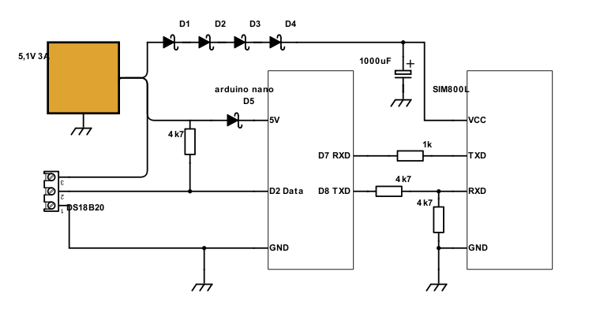
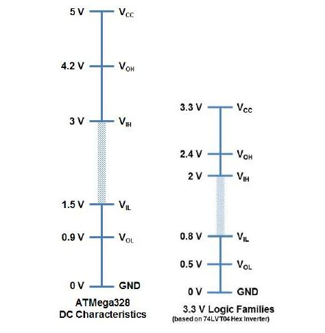
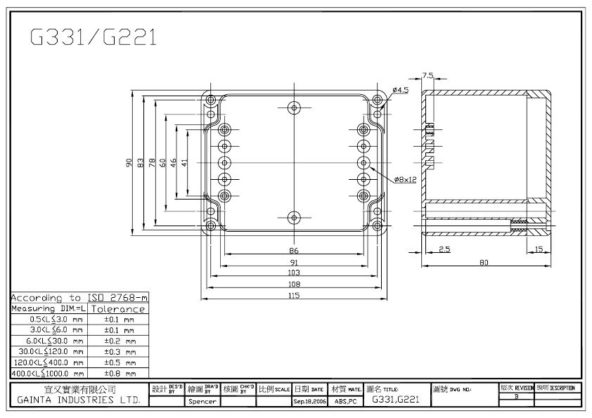
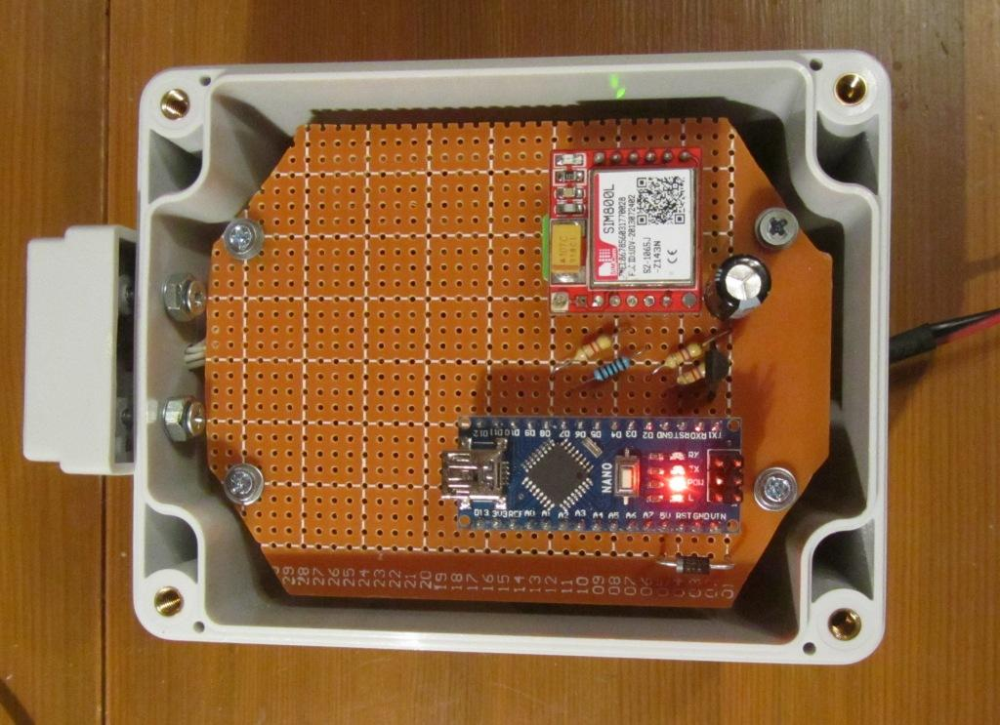
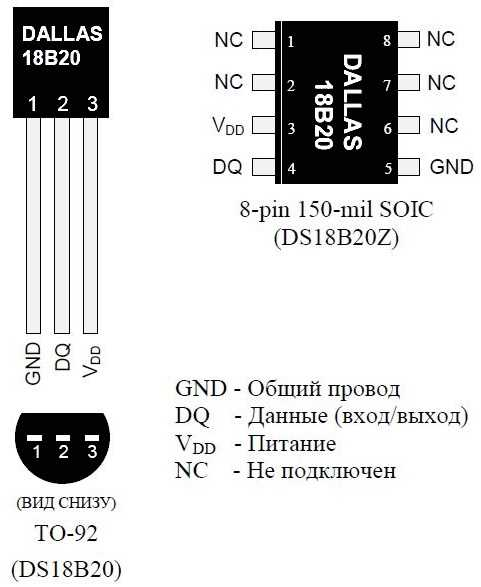
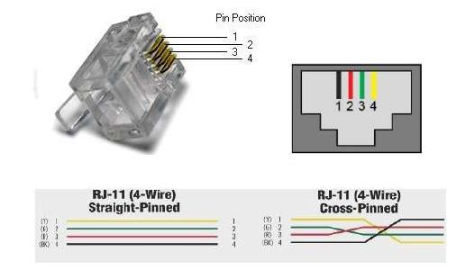

# SMS-термометр Журавли GRUS2

Задача: получать показания термометра дистанционно, посредством SMS-сообщений.

Берём на вооружение плату контроллера Arduino Nano, модем SIM800L и цифровые датчики температуры DS18B20.


## Схема электрическая принципиальная
Блок питания выдаёт стабилизированные 5,1 вольт, которые, в целях защиты платы, через диод Шоттки 1N5817 поступают на контроллер Arduino Nano, и, в целях снижения напряжения питания до 4 вольт, через четыре последовательно соединённых диодов 1N5817 на модем SIM800L.



Согласование логических уровней ТТЛ и КМОП микросхем выполнено на резисторном делителе.



## Корпус
Всю электронную начинку поместили в корпус G221 производства Gainta Industries Ltd.



## Внешний вид SMS-термометра



## Подсоединение датчиков DS18B20

Назначение выводов цифрового измерителя температуры DS18B20



Датчики подсоединяем к SMS-термометру телефонным 4-х жильным кабелем. 



Мы одну из вилок что на конце кабеля срезаем и на её место располагаем датчик DS18B20 по следующей раскладке:

```
Контакты    Контакты     Цвет 
RJ-14 6P4C  DS18B20      (прямой раскладки)  
--- 1 ---   не использ.  чёрный 
--- 2 ---   Data         красный 
--- 3 ---   GND          зелёный
--- 4 ---   +5V          жёлтый
```

## GSM модуль SIM800L

- https://simcom.ee/documents/SIM800L/SIM800L%28MT6261%29_Hardware%20Design_V1.01.pdf
 
- https://simcom.ee/documents/SIM800H/SIM800%20Series_AT%20Command%20Manual_V1.10.pdf
 
### Электропитание

Диапазон электропитания SIM800L составляет от 3,4 В до 4,4 В. Рекомендуемое напряжение - 4,0 В. Источник питания должен обеспечивать ток до 2 А. Вход VBAT настоятельно рекомендуется шунтировать конденсатором с низким внутренним сопротивлением (low ESR, equivalent series resistance), например, 100 мкФ.

### Функция сброса
 
SIM800L имеет контакт RESET, используемый для сброса модуля. Пользователь может замкнуть контакт RESET на землю, после чего модуль перезагрузится. 

Электрические характеристики контакта RESET: 
```
VIH min 2.4 V 
VIL max 0.6 V
Low power time 105 ms
```

### Последовательный порт

SIM800L предоставляет один асинхронный последовательный порт, который поддерживат скорости передачи между модулем (как DCE, оборудование передачи данных) и клиентом (DTE, оборудование терминала данных) 1200, 2400, 4800, 9600, 19200, 38400, 57600 and 115200 bps. Параметры последоваетльного порта клиента (DTE) должны быть установлены at 8 data bits, no parity and 1 stop bit. 

Электрические характеристики последовательного порта:
```
Symbol  Min  Typ  Max  Unit 
VIL    -0.3   -   0.7   V 
VIH     2.1   -   3.1   V 
VOL      -    -   0.4   V 
VOH     2.4  2.8   -    V 
```

Рекомендуемое соединение между модулем DCE (SIM800L) и DTE 3,3 В.


