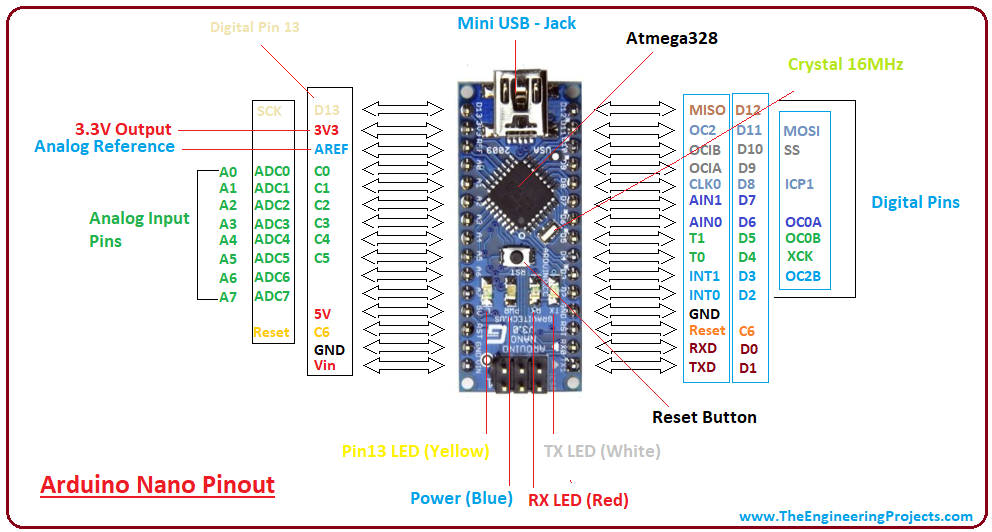

# SMS-термометр Журавли GRUS2

Задача: получать показания термометра дистанционно, посредством SMS-сообщений.

Берём на вооружение плату контроллера Arduino Nano, модем SIM800L и цифровые датчики температуры DS18B20.




## Схема электрическая принципиальная
Блок питания выдаёт стабилизированные 5,1 вольт, которые, в целях защиты платы, через диод Шоттки 1N5817 поступают на контроллер Arduino Nano, и, в целях снижения напряжения питания до 4 вольт, через четыре последовательно соединённых диодов 1N5817 на модем SIM800L.


Согласование логических уровней ТТЛ и КМОП микросхем выполнено на резисторном делителе.


## Корпус
Всю электронную начинку поместили в корпус G221 производства Gainta Industries Ltd.


## Внешний вид SMS-термометра


## Подсоединение датчиков DS18B20

Назначение выводов цифрового измерителя температуры DS18B20


Датчики подсоединяем к SMS-термометру телефонным 4-х жильным кабелем. 


Мы одну из вилок что на конце кабеля срезаем и на её место располагаем датчик DS18B20 по следующей раскладке:

```
Контакты    Контакты     Цвет 
RJ-14 6P4C  DS18B20      (прямой раскладки)  
--- 1 ---   не использ.  чёрный 
--- 2 ---   Data         красный 
--- 3 ---   GND          зелёный
--- 4 ---   +5V          жёлтый
```
